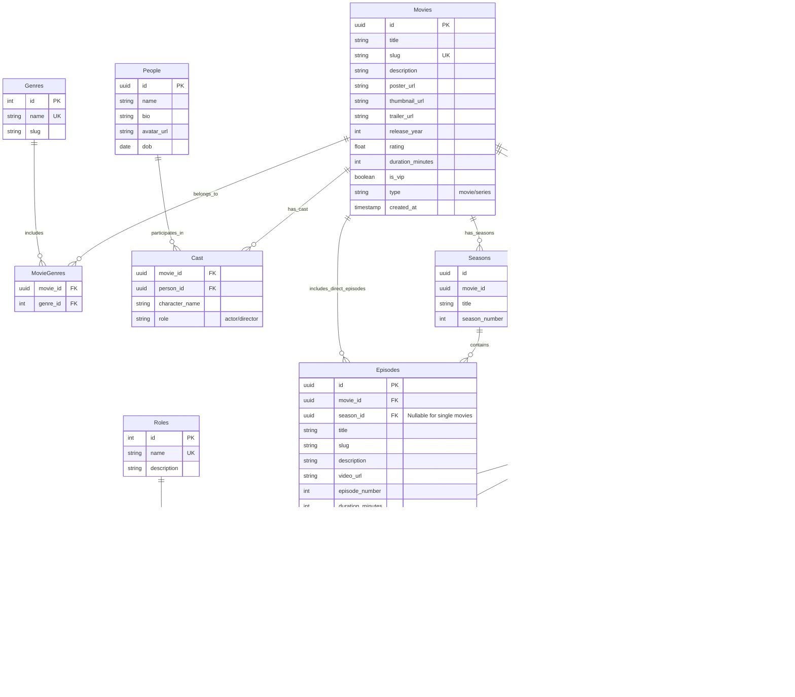

# Database Schema Design

```mermaid
erDiagram
    Users {
        uuid id PK
        string email UK
        string password
        string full_name
        string avatar_url
        boolean is_active
        timestamp created_at
        timestamp updated_at
    }

    Roles {
        int id PK
        string name UK
        string description
    }

    UserRoles {
        uuid user_id FK
        int role_id FK
    }

    Movies {
        uuid id PK
        string title
        string slug UK
        string description
        string poster_url
        string thumbnail_url
        string trailer_url
        int release_year
        float rating
        int duration_minutes
        boolean is_vip
        string type "movie/series"
        timestamp created_at
    }

    Genres {
        int id PK
        string name UK
        string slug
    }

    MovieGenres {
        uuid movie_id FK
        int genre_id FK
    }

    People {
        uuid id PK
        string name
        string bio
        string avatar_url
        date dob
    }

    Cast {
        uuid movie_id FK
        uuid person_id FK
        string character_name
        string role "actor/director"
    }

    Seasons {
        uuid id PK
        uuid movie_id FK
        string title
        int season_number
    }

    Episodes {
        uuid id PK
        uuid movie_id FK
        uuid season_id FK "Nullable for single movies"
        string title
        string slug
        string description
        string video_url
        int episode_number
        int duration_minutes
        timestamp created_at
    }

    WatchHistory {
        uuid id PK
        uuid user_id FK
        uuid episode_id FK
        uuid movie_id FK
        float progress_seconds
        boolean is_finished
        timestamp last_watched_at
    }

    Reviews {
        uuid id PK
        uuid user_id FK
        uuid movie_id FK
        int rating
        string comment
        timestamp created_at
    }

    Subscriptions {
        uuid id PK
        uuid user_id FK
        string plan_name
        timestamp start_date
        timestamp end_date
        string status
    }

    Users ||--o{ UserRoles : has
    Roles ||--o{ UserRoles : assigned_to

    Movies ||--o{ MovieGenres : belongs_to
    Genres ||--o{ MovieGenres : includes

    Movies ||--o{ Cast : has_cast
    People ||--o{ Cast : participates_in

    Movies ||--o{ Seasons : has_seasons
    Seasons ||--o{ Episodes : contains
    Movies ||--o{ Episodes : includes_direct_episodes

    Users ||--o{ WatchHistory : watches
    Movies ||--o{ WatchHistory : tracked_in
    Episodes ||--o{ WatchHistory : tracked_in

    Users ||--o{ Reviews : writes
    Movies ||--o{ Reviews : receives

    Users ||--o{ Subscriptions : purchases
```
